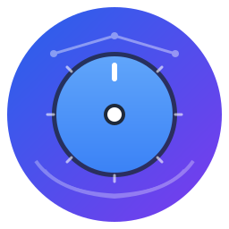

<div align="center">
  
  
  # 🎛️ DDAP - Developer in Control
  
  > Dynamic Data API Provider. You control everything. We handle the boilerplate.
  
  [](https://www.nuget.org/packages/Ddap.Core)
  [](LICENSE)
  [](https://github.com/schivei/ddap/actions)
</div>

## ⚡ What is DDAP?

DDAP automatically generates REST, GraphQL, and gRPC APIs from your database schema—but **without forcing any decisions on you**.

Unlike other frameworks that lock you into specific libraries, databases, or patterns, DDAP provides **infrastructure only**. You choose:
- 🗄️ Your database (SQL Server, MySQL, PostgreSQL, SQLite, or custom)
- 🔧 Your ORM (Dapper or Entity Framework)
- 🎨 Your serializer (System.Text.Json, Newtonsoft.Json, or any)
- 🌐 Your API style (REST, GraphQL, gRPC, or all three)

**DDAP discovers your schema, generates base types, and gets out of your way.**

---

## 🎯 Developer in Control

| What DDAP Provides | What You Control |
|--------------------|------------------|
| ✅ Entity discovery from database | 🎯 Database type (SQL Server, MySQL, etc.) |
| ✅ Metadata mapping (tables, columns, keys) | 🎯 ORM choice (Dapper or Entity Framework) |
| ✅ Base API types (controllers, queries, services) | 🎯 Serialization library (any JSON library) |
| ✅ Auto-Reload infrastructure | 🎯 Auto-Reload configuration (when, how) |
| ✅ Hooks and lifecycle callbacks | 🎯 GraphQL configuration (complete control) |
| ✅ Partial classes for extension | 🎯 REST configuration (formatters, routing) |
| ✅ Project templates (`dotnet new`) | 🎯 gRPC configuration (services, options) |
| | 🎯 **Everything else!** |

### ❌ Other Frameworks vs ✅ DDAP

```
┌─────────────────────────────────────┐
│  🚫 Opinionated Frameworks          │
│  ❌ Force Newtonsoft.Json           │
│  ❌ Hardcode XML/YAML formatters    │
│  ❌ Database-specific packages      │
│  ❌ Hidden configurations           │
│  ❌ Lock you into patterns          │
└─────────────────────────────────────┘

┌─────────────────────────────────────┐
│  ✅ DDAP - Developer in Control     │
│  ✅ You choose serializer           │
│  ✅ You configure formatters        │
│  ✅ Single Dapper, ANY database     │
│  ✅ Everything explicit             │
│  ✅ You own the architecture        │
└─────────────────────────────────────┘
```

---

## 🤔 Why DDAP?

### The Problem: Framework Lock-In

Most API frameworks promise to speed up development, but they lock you into their choices:
- 🔒 **Fixed Dependencies**: Forced to use specific libraries (Newtonsoft.Json, Entity Framework, etc.)
- 🔒 **Hidden Magic**: Behavior you can't see, debug, or modify
- 🔒 **Database Coupling**: Tight integration with specific database providers
- 🔒 **Migration Pain**: When you need to change, you rewrite everything

**Example**: Your framework uses Newtonsoft.Json internally. You want to switch to System.Text.Json for performance. You can't—it's hardcoded. You're stuck.

### The DDAP Solution: Infrastructure, Not Opinion

DDAP takes a radically different approach. We provide **infrastructure** without forcing any decisions:

#### 🎯 Developer Empowerment
**You make every technical decision.** Want to use Dapper? Use Dapper. Want Entity Framework? Use Entity Framework. Want to switch tomorrow? Switch. DDAP adapts to your choices—you never adapt to DDAP.

```csharp
// YOUR choice of database - any IDbConnection works
builder.Services.AddDdap()
    .AddDapper(() => new MySqlConnection(...))  // Or SqlConnection, NpgsqlConnection, etc.
    .AddRest();

// Later, switch to Entity Framework - no problem
builder.Services.AddDdap()
    .AddEntityFramework<MyDbContext>()
    .AddRest();
```

#### 🪶 Minimal Dependencies
**DDAP Core has ZERO opinionated dependencies.** We don't bundle:
- ❌ No JSON library (you choose: System.Text.Json, Newtonsoft.Json, or custom)
- ❌ No database drivers (you add only what you need)
- ❌ No specific ORM version (you control your dependency graph)
- ❌ No hidden middleware (you see and control everything)

**Result**: Your application stays lean. You only pay for what you use.

#### 🛡️ Resilient Abstraction
**DDAP abstracts the right things:**
- ✅ **Schema Discovery**: We handle reading database metadata
- ✅ **Code Generation**: We generate boilerplate (controllers, queries, types)
- ✅ **API Plumbing**: We provide base classes you can extend
- ❌ **NOT Business Logic**: Your domain stays yours
- ❌ **NOT Configuration**: You configure everything explicitly

If DDAP disappeared tomorrow, your application would still work—you own the architecture.

#### 🔄 Zero-Downtime Evolution
**Auto-Reload System** detects schema changes and reloads without restarting:

```csharp
options.AutoReload = new AutoReloadOptions
{
    Enabled = true,
    IdleTimeout = TimeSpan.FromMinutes(5),
    Strategy = ReloadStrategy.InvalidateAndRebuild,  // You choose
    Behavior = ReloadBehavior.ServeOldSchema         // You choose
};
```

Deploy database changes. DDAP detects them. API updates automatically. Zero downtime.

### When to Use DDAP

✅ **Use DDAP when you want:**
- Full control over your technology stack
- To avoid framework lock-in
- Minimal dependencies in your application
- Explicit, debuggable configuration
- Freedom to evolve your architecture
- Database-first or schema-first development
- Multiple API protocols (REST + GraphQL + gRPC)

❌ **Don't use DDAP if:**
- You prefer frameworks that make all decisions for you
- You're building a non-database-backed API
- You want an all-in-one solution with batteries included
- You're okay with framework lock-in

### The DDAP Philosophy

> **"Framework features should be opt-in, not opt-out. Decisions should be explicit, not implicit. The developer should control the framework, not the other way around."**

**DDAP is infrastructure you control, not a framework that controls you.**

---

## 🚀 Quick Start

### 1. Install packages

```bash
dotnet add package Ddap.Core
dotnet add package Ddap.Data.Dapper  # OR Ddap.Data.EntityFramework
dotnet add package Ddap.GraphQL      # Optional
dotnet add package Ddap.Rest         # Optional
dotnet add package Ddap.Grpc         # Optional
```

### 2. Configure (Dapper example)

```csharp
using Microsoft.Data.SqlClient;

var builder = WebApplication.CreateBuilder(args);

// YOU choose the database connection
builder.Services.AddDdap()
    .AddDapper(() => new SqlConnection(
        builder.Configuration.GetConnectionString("DefaultConnection")
    ))
    .AddRest()
    .AddGraphQL(graphql =>
    {
        // YOU configure HotChocolate
        graphql
            .AddFiltering()
            .AddSorting()
            .AddProjections();
    });

var app = builder.Build();
app.MapControllers();
app.MapGraphQL();
app.Run();
```

### 3. Done! 🎉

- REST: `GET /api/entity`
- GraphQL: `POST /graphql { entities { name } }`

### OR Use the Template

```bash
dotnet new install Ddap.Templates
dotnet new ddap-api --name MyApi
cd MyApi
dotnet run
```

---

## ✨ Features

### 🗄️ Database Agnostic
- **Dapper:** Works with ANY `IDbConnection` (SQL Server, MySQL, PostgreSQL, SQLite, Oracle, etc.)
- **Entity Framework:** Use your existing `DbContext`

### 🌐 Multi-Protocol APIs
- **REST:** Standard HTTP/JSON endpoints with full controller customization
- **GraphQL:** Powered by HotChocolate, fully configurable
- **gRPC:** High-performance RPC, configurable services

### 🔄 Auto-Reload System
Automatically reloads database schema after idle periods:
- ✅ **3 Strategies:** InvalidateAndRebuild, HotReloadIncremental, RestartExecutor
- ✅ **3 Behaviors:** ServeOldSchema, BlockRequests, QueueRequests
- ✅ **3 Detection Methods:** AlwaysReload, CheckHash, CheckTimestamps
- ✅ **Lifecycle Hooks:** OnBeforeReloadAsync, OnAfterReloadAsync

```csharp
options.AutoReload = new AutoReloadOptions
{
    Enabled = true,
    IdleTimeout = TimeSpan.FromMinutes(5),
    Strategy = ReloadStrategy.InvalidateAndRebuild,
    Behavior = ReloadBehavior.ServeOldSchema,
    Detection = ChangeDetection.CheckHash
};
```

### 📦 Project Templates
```bash
dotnet new ddap-api --database-provider dapper --database-type mysql --api-providers "rest,graphql"
```

### 🎛️ Zero Opinions
- No forced dependencies
- No hidden configurations
- No magic behavior
- **You configure everything**

### 🔧 Fully Extensible
```csharp
// Extend via partial classes
namespace Ddap.Rest;

public partial class EntityController
{
    [HttpGet("custom")]
    public IActionResult Custom() => Ok("Your endpoint");
}
```

---

## 🏗️ Architecture

```
┌───────────────────────────────────────────┐
│          Your Application                 │
│  (Controllers, Services, Business Logic)  │
└───────────────┬───────────────────────────┘
                │
┌───────────────▼───────────────────────────┐
│        DDAP Core Infrastructure           │
│  ✅ Entity Discovery                      │
│  ✅ Metadata Mapping                      │
│  ✅ Base Type Generation                  │
│  ✅ Auto-Reload Management                │
│  ✅ Lifecycle Hooks                       │
└───────────────┬───────────────────────────┘
                │
┌───────────────▼───────────────────────────┐
│       Your Configuration Choices          │
│  🎯 Database: SQL Server / MySQL / etc.  │
│  🎯 ORM: Dapper / Entity Framework        │
│  🎯 Serializer: System.Text.Json / etc.  │
│  🎯 APIs: REST / GraphQL / gRPC           │
└───────────────────────────────────────────┘
```

---

## 📦 Packages

### Package Status Legend
- ✅ **Stable**: Production-ready, fully tested
- ⚠️ **Known Issues**: Functional with documented issues

### Core Infrastructure

| Package | Description | Status |
|---------|-------------|--------|
| `Ddap.Core` | Core abstractions, infrastructure, and base types | ✅ Stable |

### Data Access Providers

| Package | Description | Status |
|---------|-------------|--------|
| **Dapper-Based** | | |
| `Ddap.Data.Dapper` | Dapper provider (works with ANY `IDbConnection`) | ✅ Stable |
| **Entity Framework-Based** | | |
| `Ddap.Data.EntityFramework` | Entity Framework Core provider | ✅ Stable |

> **Note**: Dapper is database-agnostic. Add your database driver (e.g., `Microsoft.Data.SqlClient`, `MySqlConnector`, `Npgsql`) alongside `Ddap.Data.Dapper`.

### API Protocol Providers

| Package | Description | Status |
|---------|-------------|--------|
| `Ddap.Rest` | REST API endpoints with full controller customization | ✅ Stable |
| `Ddap.GraphQL` | GraphQL API powered by HotChocolate | ✅ Stable |
| `Ddap.Grpc` | High-performance gRPC services | ✅ Stable |

### Additional Features

| Package | Description | Status |
|---------|-------------|--------|
| `Ddap.Auth` | JWT authentication and authorization | ✅ Stable |
| `Ddap.Subscriptions` | Real-time subscriptions (WebSockets, SignalR) | ✅ Stable |
| `Ddap.Aspire` | .NET Aspire orchestration and observability | ✅ Stable |

### Development Tools

| Package | Description | Status |
|---------|-------------|--------|
| `Ddap.Templates` | Project templates (`dotnet new ddap-api`) | ⚠️ [Known Issues](https://github.com/schivei/ddap/issues) |
| `Ddap.CodeGen` | Source generators for boilerplate code | ✅ Stable |

> **⚠️ Template Known Issue**: API provider flags (--rest, --graphql, --grpc) currently not working. Fix in progress. [Track issue](https://github.com/schivei/ddap/issues)

### Client Libraries

| Package | Description | Status |
|---------|-------------|--------|
| `Ddap.Client.Core` | Core client abstractions and base types | ✅ Stable |
| `Ddap.Client.Rest` | Type-safe REST client | ✅ Stable |
| `Ddap.Client.GraphQL` | GraphQL client with query building | ✅ Stable |
| `Ddap.Client.Grpc` | High-performance gRPC client | ✅ Stable |

---

## 📚 Documentation

- 🎯 **[Philosophy](https://schivei.github.io/ddap/philosophy)** - Developer in Control
- 📖 **[Getting Started](https://schivei.github.io/ddap/get-started)** - Step-by-step guide
- 🗄️ **[Database Providers](https://schivei.github.io/ddap/database-providers)** - Dapper vs EF
- 🌐 **[API Providers](https://schivei.github.io/ddap/api-providers)** - REST, GraphQL, gRPC
- 🔄 **[Auto-Reload](https://schivei.github.io/ddap/auto-reload)** - Schema refresh system
- 📦 **[Templates](https://schivei.github.io/ddap/templates)** - `dotnet new` guide
- 🏗️ **[Architecture](https://schivei.github.io/ddap/architecture)** - How it works
- 🔧 **[Advanced](https://schivei.github.io/ddap/advanced)** - Extensibility
- 🔍 **[Troubleshooting](https://schivei.github.io/ddap/troubleshooting)** - Common issues

---

## 🤝 Contributing

Contributions welcome! See [CONTRIBUTING.md](CONTRIBUTING.md)

---

## 📄 License

MIT License - see [LICENSE](LICENSE)

---

## ⭐ Star History

If DDAP helps you, please star the repo! 🌟

---

**Built with ❤️ by developers who believe in control, not constraints.**
