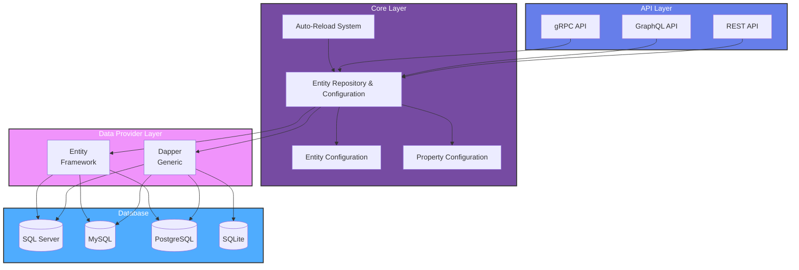

# DDAP Architecture

This document provides an overview of DDAP's architecture, design principles, and how the different components work together.

## Architecture Overview

DDAP follows a modular, layered architecture with clear separation of concerns:



## Core Concepts

### 1. Entity Configuration

The heart of DDAP is the `IEntityConfiguration` interface, which represents metadata about database tables:

```csharp
public interface IEntityConfiguration
{
    string Name { get; }
    string Schema { get; }
    IReadOnlyList<IPropertyConfiguration> Properties { get; }
    IReadOnlyList<IIndexConfiguration> Indexes { get; }
    IReadOnlyList<IRelationshipConfiguration> Relationships { get; }
}
```

**Key Features:**
- Represents database tables/entities
- Contains property (column) metadata
- Includes index and relationship information
- Supports composite keys and complex relationships

### 2. Entity Repository

The `IEntityRepository` is the central registry for all entity configurations:

```csharp
public interface IEntityRepository
{
    IReadOnlyList<IEntityConfiguration> Entities { get; }
    IEntityConfiguration? GetEntity(string name);
    void AddEntity(IEntityConfiguration entity);
}
```

**Responsibilities:**
- Store and manage entity configurations
- Provide entity lookup by name
- Thread-safe access to entity metadata

### 3. Data Provider Abstraction

The `IDataProvider` interface abstracts database-specific logic:

```csharp
public interface IDataProvider
{
    Task LoadEntitiesAsync(IEntityRepository repository);
    // Additional database operations...
}
```

**Benefits:**
- Database-agnostic core
- Pluggable database support
- Consistent API across providers

### 4. Auto-Reload System

The Auto-Reload System automatically detects and applies database schema changes:

```csharp
public class AutoReloadOptions
{
    public bool Enabled { get; set; }
    public TimeSpan IdleTimeout { get; set; }
    public ReloadStrategy Strategy { get; set; }
    public ReloadBehavior Behavior { get; set; }
    public ChangeDetection Detection { get; set; }
}
```

**Features:**
- Zero-downtime schema updates
- Multiple reload strategies (HotReload, RestartExecutor, InvalidateAndRebuild)
- Change detection methods (AlwaysReload, CheckHash, CheckTimestamps)
- Lifecycle hooks for custom logic
- Configurable behaviors (ServeOldSchema, BlockRequests, QueueRequests)

> **Learn more:** See [Auto-Reload Guide](./auto-reload.md) for detailed configuration and usage.

## Component Details

### Core Package (Ddap.Core)

**Purpose:** Provides abstractions and core functionality

**Key Components:**
- `IEntityConfiguration` - Entity metadata interface
- `IPropertyConfiguration` - Property/column metadata
- `IIndexConfiguration` - Index metadata
- `IRelationshipConfiguration` - Foreign key relationships
- `IEntityRepository` - Entity registry
- `IDataProvider` - Database provider abstraction
- `IDdapBuilder` - Fluent configuration API

**Design Principles:**
- Interface-based design for extensibility
- No database-specific code
- Minimal dependencies
- Internal implementation classes in `Internals/` folder

### Data Provider Packages

Each database provider implements `IDataProvider` and loads database metadata:

#### Ddap.Data.Dapper
- **Single generic package** for any database with `IDbConnection`
- Supports SQL Server, MySQL, PostgreSQL, SQLite, Oracle, and more
- Database-specific metadata queries for indexes and relationships
- Full support for composite keys and complex relationships
- **You bring your own database driver** (Microsoft.Data.SqlClient, Npgsql, MySqlConnector, etc.)

> **Architecture Note:** Previous architecture had separate packages (e.g., `Ddap.Data.Dapper.SqlServer`). The new architecture uses a single `Ddap.Data.Dapper` package that works with any database driver you choose.

#### Ddap.Data.EntityFramework
- Database-agnostic using EF Core
- Uses EF's model metadata
- Works with any EF-supported database

### API Provider Packages

#### Ddap.Rest
- Generates REST controllers via partial classes
- Content negotiation (JSON/XML)
- Uses Newtonsoft.Json for JSON serialization
- Entity metadata endpoints

**Endpoints Generated:**
```
GET    /api/entity              - List all entities
GET    /api/entity/{name}       - Get entity data
GET    /api/entity/{name}/metadata - Get entity metadata
POST   /api/entity/{name}       - Create entity
PUT    /api/entity/{name}/{id}  - Update entity
DELETE /api/entity/{name}/{id}  - Delete entity
```

#### Ddap.GraphQL
- Generates GraphQL schema dynamically
- Query and Mutation types
- Entity metadata queries
- Hot Chocolate integration

**Schema Example:**
```graphql
type Query {
  entities: [EntityMetadata!]!
  entity(entityName: String!): EntityMetadata
}

type EntityMetadata {
  name: String!
  schema: String!
  propertyCount: Int!
}
```

#### Ddap.Grpc
- Generates gRPC services
- Protocol buffer definitions
- Entity CRUD operations
- .proto file generation

### Additional Packages

#### Ddap.CodeGen
- Source generators for compile-time code generation
- Reduces runtime overhead
- Generates strongly-typed entity classes

#### Ddap.Aspire
- .NET Aspire integration
- Automatic service discovery
- Connection string management
- Auto-reload support for schema changes

#### Ddap.Auth
- Authentication and authorization support
- Entity-level security
- Integration with ASP.NET Core Identity

#### Ddap.Subscriptions
- Real-time data updates
- WebSocket support
- SignalR integration
- GraphQL subscriptions

## Design Patterns

### Builder Pattern

DDAP uses the builder pattern for fluent configuration:

```csharp
var connectionString = "...";
builder.Services
    .AddDdap(options => { /* configure */ })
    .AddDapper(() => new SqlConnection(connectionString))
    .AddRest()
    .AddGraphQL();
```

**Benefits:**
- Clear, readable configuration
- Chainable method calls
- Type-safe configuration

### Partial Classes

All generated controllers, services, and types are partial classes:

```csharp
public partial class EntityController : ControllerBase
{
    // Generated code...
}
```

**Benefits:**
- Easy extensibility
- Custom logic without modifying generated code
- Separation of concerns

### Dependency Injection

All components use constructor injection:

```csharp
public class EntityController
{
    private readonly IEntityRepository _repository;
    
    public EntityController(IEntityRepository repository)
    {
        _repository = repository;
    }
}
```

**Benefits:**
- Testability
- Loose coupling
- ASP.NET Core integration

## Data Flow

### Startup Flow

1. **Configuration Phase**
   ```
   AddDdap() → Register core services
   AddDapper() → Register data provider
   AddRest() → Register REST controllers
   AddGraphQL() → Register GraphQL schema (optional)
   ```

2. **Initialization Phase**
   ```
   Application starts → Data provider loads metadata
   → Populates EntityRepository → APIs ready
   → Auto-Reload monitors for changes (if enabled)
   ```

3. **Request Handling**
   ```
   HTTP Request → Controller/GraphQL → EntityRepository
   → Returns metadata or data → Response
   ```

4. **Auto-Reload Flow** (if enabled)
   ```
   Idle timeout expires → Check for schema changes
   → If changes detected → Reload entities
   → Apply reload strategy → Resume serving requests
   ```

### Entity Loading Flow

```
IDataProvider.LoadEntitiesAsync()
  ↓
Query database metadata (tables, columns, indexes, relationships)
  ↓
Create IEntityConfiguration instances
  ↓
Add to IEntityRepository
  ↓
APIs can now use entity metadata
```

## Extensibility Points

### 1. Custom Controllers

Add custom endpoints to generated controllers:

```csharp
namespace Ddap.Rest;

public partial class EntityController
{
    [HttpGet("custom/{name}")]
    public IActionResult CustomEndpoint(string name)
    {
        // Custom logic
    }
}
```

### 2. Custom Data Providers

Implement `IDataProvider` for new databases:

```csharp
public class MyDatabaseProvider : IDataProvider
{
    public async Task LoadEntitiesAsync(IEntityRepository repository)
    {
        // Load metadata from your database
    }
}
```

### 3. Custom API Providers

Create new API providers:

```csharp
public static class MyApiProviderExtensions
{
    public static IDdapBuilder AddMyApi(this IDdapBuilder builder)
    {
        // Register your services
        return builder;
    }
}
```

### 4. Source Generators

Use Ddap.CodeGen for compile-time code generation:

```csharp
[DdapEntity]
public partial class MyEntity
{
    // Properties generated at compile-time
}
```

## Performance Considerations

### Metadata Caching

- Entity metadata is loaded once at startup
- Cached in `IEntityRepository`
- No per-request metadata queries

### Code Generation

- Source generators create code at compile-time
- Reduces runtime reflection
- Improves startup performance

### Dapper vs Entity Framework

- **Dapper providers**: Lower memory, faster queries
- **EF provider**: More features, slower but flexible

### Content Negotiation

- Format selection happens early in pipeline
- Newtonsoft.Json for JSON (configurable)
- XML formatters cached

## Security

### SQL Injection Protection

- All data providers use parameterized queries
- No string concatenation for SQL
- Safe from SQL injection attacks

### Code Coverage Exclusion

Generated code is automatically excluded from code coverage:

```xml
<ExcludeFromCodeCoverage>true</ExcludeFromCodeCoverage>
```

## Testing Strategy

### Unit Testing

Test core abstractions and interfaces:

```csharp
[Fact]
public void EntityRepository_AddEntity_StoresEntity()
{
    var repository = new EntityRepository();
    var entity = CreateTestEntity();
    
    repository.AddEntity(entity);
    
    Assert.Contains(entity, repository.Entities);
}
```

### Integration Testing

Test with real databases using containers:

```csharp
[Fact]
public async Task DapperProvider_LoadsEntities()
{
    using var container = new SqlServerContainer();
    await container.StartAsync();
    
    var connectionString = container.GetConnectionString();
    var provider = new DapperDataProvider(() => new SqlConnection(connectionString));
    var repository = new EntityRepository();
    
    var entities = await provider.LoadEntitiesAsync(CancellationToken.None);
    
    foreach (var entity in entities)
    {
        repository.AddOrUpdateEntity(entity);
    }
    
    Assert.NotEmpty(repository.Entities);
}
```

## Deployment

### NuGet Packages

Each component is a separate NuGet package:

- Install only what you need
- Reduces deployment size
- Clear dependency graph

### Docker Support

Works in containers:

```dockerfile
FROM mcr.microsoft.com/dotnet/aspnet:10.0
COPY bin/Release/net10.0/publish/ /app
WORKDIR /app
ENTRYPOINT ["dotnet", "MyDdapApi.dll"]
```

### .NET Aspire

Optimized for .NET Aspire:

```csharp
builder.AddDdapApi("api")
       .WithReference(db)
       .WithRestApi()
       .WithAutoRefresh(30);
```

## Future Architecture Considerations

### Planned Enhancements

1. **Enhanced Source Generators**
   - More compile-time code generation
   - Reduced runtime overhead

2. **Dynamic Proto File Endpoints**
   - gRPC clients can download .proto files
   - Automatic client generation

3. **REST from gRPC**
   - Generate REST endpoints from gRPC services
   - Unified service definitions

4. **Advanced Query Engine**
   - OData-like filtering
   - Complex sorting and pagination

5. **Real-time Subscriptions**
   - GraphQL subscriptions
   - SignalR integration
   - WebSocket support

## Conclusion

DDAP's architecture prioritizes:

- **Developer Control**: You make all technology choices
- **Modularity**: Use only what you need
- **Extensibility**: Easy to customize and extend
- **Performance**: Efficient metadata loading and caching
- **Zero Downtime**: Auto-reload keeps APIs running during schema changes
- **Maintainability**: Clear separation of concerns
- **Testability**: Interface-based design

For more details, see:
- [Philosophy](./philosophy.md) - Developer in Control approach
- [Get Started](./get-started.md) - Quick start guide
- [Auto-Reload](./auto-reload.md) - Schema reloading system
- [Advanced Usage](./advanced.md) - Extensibility patterns
- [API Providers](./api-providers.md) - REST, GraphQL, gRPC
- [Database Providers](./database-providers.md) - Dapper and EF
