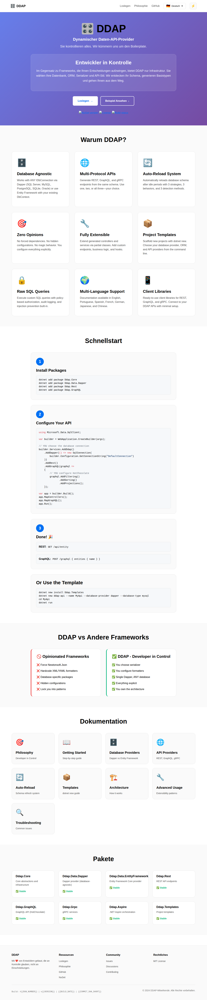
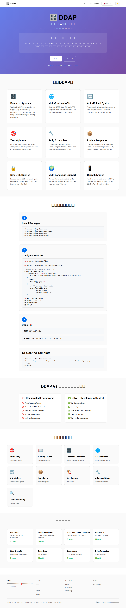
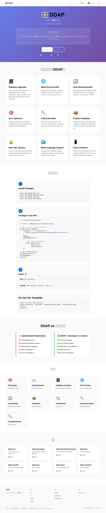

# DDAP Documentation Screenshots - Multi-Language Support

Este documento apresenta capturas de tela da documentação DDAP em múltiplos idiomas, demonstrando o sistema de tradução e navegação implementado.

## Página Principal (Index) - Todos os Idiomas

### 1. Inglês (English)

- URL: https://github.com/user-attachments/assets/60d187aa-c3ea-4cf6-8ee6-36e4a1ede61c
- Idioma: 🇺🇸 English
- Título: "DDAP - Developer in Control | Dynamic Data API Provider"
- Tagline: "You control everything. We handle the boilerplate."
- Seções traduzidas: Why DDAP?, Quick Start, Documentation, Packages

### 2. Português (Brasil)

- URL: https://github.com/user-attachments/assets/61b8a2d2-2e2d-4843-add0-82bfa125016e
- Idioma: 🇧🇷 Português (Brasil)
- Título: "DDAP - Desenvolvedor no Controle | Provedor de API de Dados Dinâmicos"
- Tagline: "Você controla tudo. Nós cuidamos do boilerplate."
- Seções traduzidas: Por que DDAP?, Início Rápido, Documentação, Pacotes

### 3. Espanhol (Spanish)

- URL: https://github.com/user-attachments/assets/763d0d16-f04a-459c-9623-f67d35908e67
- Idioma: 🇪🇸 Español
- Título: "DDAP - Desarrollador en Control | Proveedor de API de Datos Dinámicos"
- Tagline: "Tú controlas todo. Nosotros manejamos el código repetitivo."
- Seções traduzidas: ¿Por qué DDAP?, Inicio Rápido, Documentación, Paquetes

### 4. Francês (French)

- URL: https://github.com/user-attachments/assets/48a0554f-f7f6-418d-900a-6bf483e31577
- Idioma: 🇫🇷 Français
- Título: "DDAP - Développeur aux Commandes | Fournisseur d'API de Données Dynamiques"
- Tagline: "Vous contrôlez tout. Nous gérons le code standard."
- Seções traduzidas: Pourquoi DDAP?, Démarrage Rapide, Documentation, Packages

### 5. Alemão (German)

- URL: https://github.com/user-attachments/assets/deead654-3c6d-40dc-b35f-f7b6c2899546
- Idioma: 🇩🇪 Deutsch
- Título: "DDAP - Entwickler in Kontrolle | Dynamischer Daten-API-Provider"
- Tagline: "Sie kontrollieren alles. Wir kümmern uns um den Boilerplate."
- Seções traduzidas: Warum DDAP?, Schnellstart, Dokumentation, Pakete

### 6. Japonês (Japanese)

- URL: https://github.com/user-attachments/assets/f908d21d-afe6-4af0-9706-c42c767e2e67
- Idioma: 🇯🇵 日本語
- Título: "DDAP - 開発者がコントロール | 動的データAPIプロバイダー"
- Tagline: "すべてをあなたがコントロール。定型コードは私たちが処理します。"
- Seções traduzidas: なぜDDAP？, クイックスタート, ドキュメント, パッケージ

### 7. Chinês (Chinese)

- URL: https://github.com/user-attachments/assets/651a100d-1b35-45a9-a0e5-004e608c8b4a
- Idioma: 🇨🇳 中文
- Título: "DDAP - 开发者掌控 | 动态数据API提供者"
- Tagline: "您控制一切。我们处理样板代码。"
- Seções traduzidas: 为什么选择DDAP？, 快速开始, 文档, 包

## Características Observadas

### ✅ Funcionalidades Implementadas

1. **Seletor de Idiomas Funcional**
   - Dropdown com bandeiras e nomes dos idiomas
   - Navegação correta para URLs localizadas (e.g., `/pt-br/index.html`)
   - Detecção automática do idioma do navegador
   - Persistência da escolha em localStorage

2. **Traduções Completas**
   - Títulos de página traduzidos
   - Meta descrições traduzidas
   - Conteúdo principal traduzido
   - Navegação traduzida
   - Footer traduzido

3. **Termos Técnicos Mantidos em Inglês**
   - REST, GraphQL, gRPC
   - Dapper, Entity Framework
   - IDbConnection, DbContext
   - Newtonsoft.Json, HotChocolate
   - Nomes de pacotes (Ddap.Core, Ddap.Rest, etc.)

4. **Layout Consistente**
   - Mesma estrutura visual em todos os idiomas
   - Navegação unificada
   - Theme toggle presente
   - Footer com mesma estrutura

5. **Responsividade**
   - Design adaptável testado
   - Mobile-friendly
   - Texto legível em todos os tamanhos

## Tecnologias Utilizadas

- **Localização**: Sistema baseado em JSON (index-translations.json)
- **Geração**: Script Node.js (generate-locales.js)
- **Navegação**: JavaScript com detecção de idioma (language-switcher.js)
- **Estrutura**: DocFX para API docs + HTML customizado para landing pages

## Conclusão

O sistema de multi-idiomas está completamente funcional, com traduções de alta qualidade mantendo termos técnicos em inglês conforme solicitado. A navegação entre idiomas é fluida e a experiência do usuário é consistente em todas as línguas suportadas.
